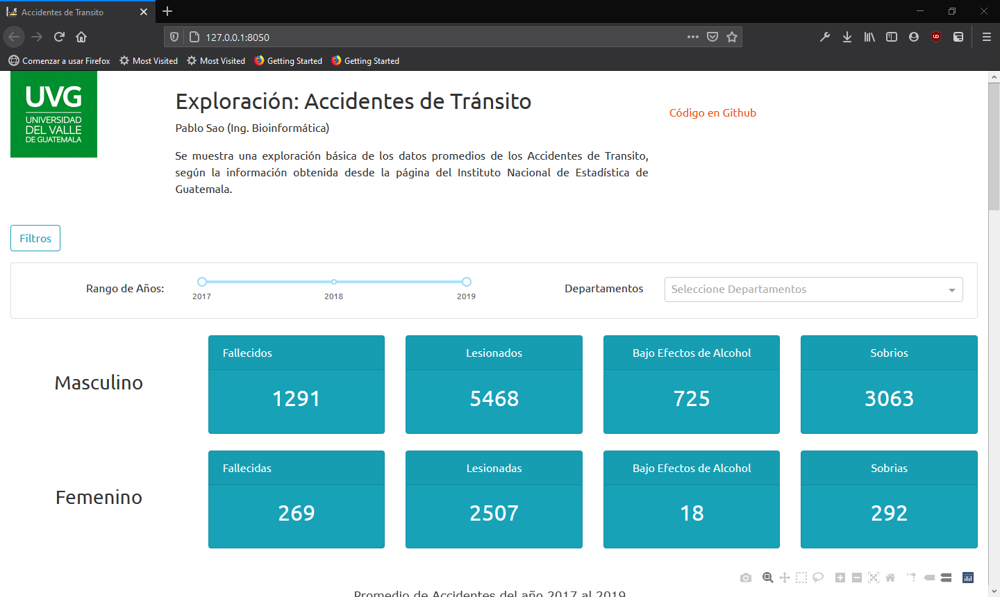

# Proyecto 1: Limpieza de Datos
<p align ="justify">
Las colisiones de transito son causados por diversos factores del vehículo, el conductor, condiciones climáticas y el estado de la carretera, por lo que es necesario contemplar diversas variables al momento de querer tomar decisiones para reducir los percances automovilísticos, evaluando en el siguiente trabajo las [fuentes de datos mostradas en el Instituto Nacional de Estadísticas de Guatemala (INE)](https://www.ine.gob.gt/estadisticasine/index.php/usuario/hechos_transito_menu), recomendando el agregar información como condiciones meteorológicas, completar el diccionario de la marca de vehículos, coordenadas del accidente, entre otros datos. Recomendando una infraestructura dedicada para los datos transformados, con el fin de presentar análisis más rápidos y eficientes, tomando en cuenta la cantidad de usuarios que estarán utilizando el análisis para determinar los recursos necesarios en la infraestructura de análisis.
</p>

<p align="center">
  <b>Imagen 1:</b> Programa en ejecución para la exploración básica de datos 

  </img>
</p>

# Requerimientos
Para poder ejecutar sin problema el proyecto se debe tener instaladas las librerías del archivo **requirements.txt**, ejecutando el siguiente comando desde la línea de comandos (Terminal)

```bash
pip install -r requirements.txt
```

# Ejecución
Para ejecutar el programa se debe ejecutar el archivo **app.py**, si se ejecuta desde la terminal debemos ubicarnos en el directorio donde se ubica el archivo y ejecutar el siguiente comando:

```bash
python app.py
```
# Autor
* Pablo Sao (Ing. Bioinformática)
